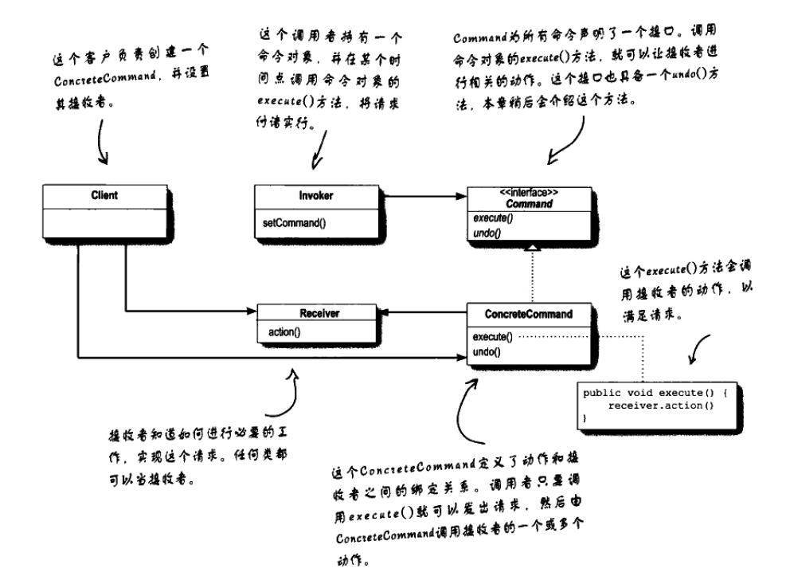

# 封装调用：命令模式  

命令对象通过在特定接收者上绑定一组动作来封装一个请求。要达到这一点，命令对象将动作和接收者包进对象中。对象只暴露一个execute()方法，当此方法被调用，接收者就会进行这些动作。

  

```java
/**
 * @author RunningWofs
 * @description 命令接口
 * @create 2020-12-17 07:55:36
 **/
public interface Command {

    void execute();

}
```

```java
/**
 * @author RunningWofs
 * @description 电灯，相当于接收者Receiver，由接收者去执行真正的action
 * @create 2020-12-17 07:58:26
 **/
public class Light {

    public void on(){
        System.out.println("light on...");
    }

    public void off(){
        System.out.println("light off...");
    }

}
```

```java
/**
 * @author RunningWofs
 * @description 开灯命令
 * @create 2020-12-17 08:00:28
 **/
public class LightOnCommand implements Command {

    Light light;

    public LightOnCommand(Light light) {
        this.light = light;
    }

    public void execute() {
        light.on();
    }
}
```

```java
/**
 * @author RunningWofs
 * @description 遥控器，相当于Invoker，命令的调用者
 * @create 2020-12-17 08:02:20
 **/
public class RemoteController {

    private Command command;

    public void setCommand(Command command) {
        this.command = command;
    }

    public void pressButton(){
        command.execute();
    }

}
```

